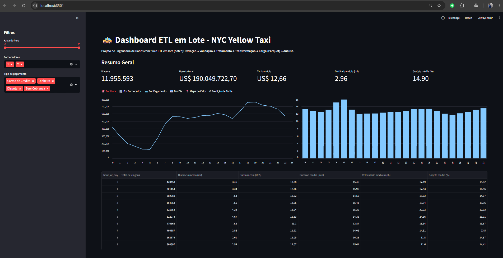
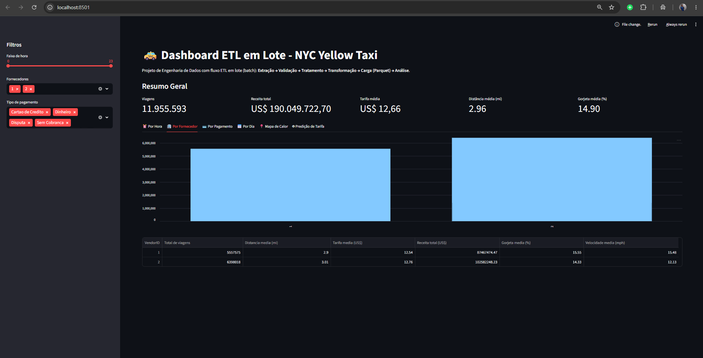
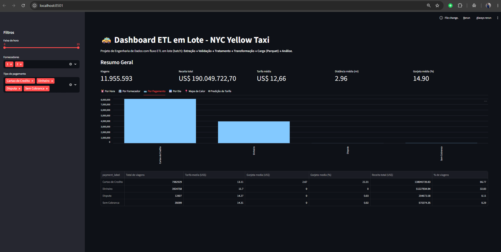
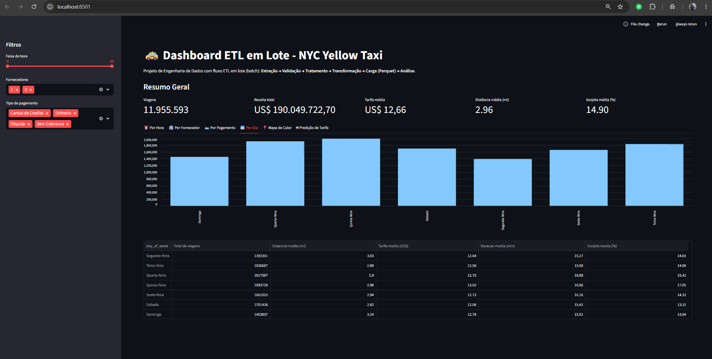
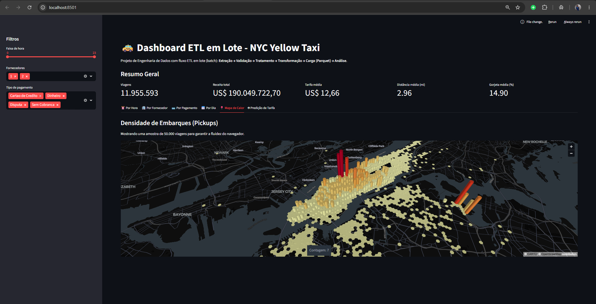
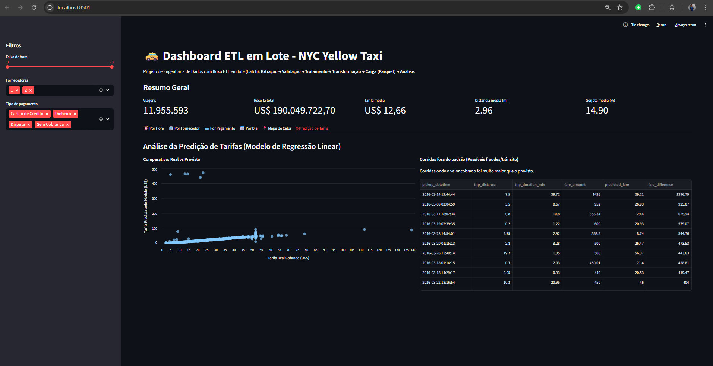

# 🚕 NYC Yellow Taxi — ETL em Lote + Dashboard + ML

Projeto de **Engenharia de Dados** com pipeline ETL em lote (batch) aplicado aos dados públicos de corridas de táxi amarelo de Nova York (março de 2016).

O projeto cobre o fluxo completo de dados:

```
CSV bruto → Validação → Limpeza → Transformação → Parquet → Dashboard → Predição ML
```

---

## 📸 Preview do Dashboard

### ⏰ Por Hora


### 🏢 Por Fornecedor


### 💳 Por Pagamento


### 📅 Por Dia da Semana


### 📍 Mapa de Calor


### 🤖 Predição de Tarifa


---

## 🗂️ Estrutura do Projeto

```
.
├── testando.py                  # Pipeline ETL completo + treinamento do modelo ML
├── dashboard.py                 # Dashboard interativo (Streamlit)
├── yellow_taxi_2016-03.parquet  # Arquivo gerado pelo ETL (não versionado)
├── pyproject.toml               # Metadados e dependências do projeto
├── .gitignore
├── por_hora.png                 # Screenshots do dashboard
├── por_fornecedor.png
├── por_pagamento.png
├── por_dia.png
├── mapa_de_calor.png
├── predicao_de_tarifa.png
└── README.md
```

> O arquivo `.parquet` e o `.csv` original **não são versionados** (listados no `.gitignore`).  
> Para reproduzir, baixe o CSV no Kaggle (link abaixo) e rode o `testando.py`.

> Acesse o Kaggle e baixe o arquivo `yellow_tripdata_2016-03.csv`:  
🔗 https://www.kaggle.com/datasets/elemento/nyc-yellow-taxi-trip-data

---

## ⚙️ Pipeline ETL (`testando.py`)

### 1 - Extração:
Leitura do arquivo `yellow_tripdata_2016-03.csv` (~11 milhões de registros) com pandas.

### 2 - Validação & Detecção de Anomalias:
Remoção de registros com:
- Distância inválida (`<= 0` ou `> 100` milhas)
- Número de passageiros inválido (`<= 0` ou `> 6`)
- Tarifa negativa
- Duração inválida (pickup posterior ao dropoff)
- Coordenadas GPS fora do bbox de NYC

### 3 - Transformação:
Criação de 7 colunas derivadas:

| Coluna | Descrição |
|---|---|
| `trip_duration_min` | Duração da corrida em minutos |
| `trip_speed_mph` | Velocidade média em milhas/hora |
| `revenue_per_mile` | Receita por milha percorrida |
| `hour_of_day` | Hora do embarque (0–23) |
| `date` | Data do embarque |
| `day_of_week` | Dia da semana do embarque |
| `tip_pct` | Gorjeta como % da tarifa base |

### 4 - Agregações:
Sumários por hora do dia, fornecedor, tipo de pagamento e dia da semana.

### 5 - Machine Learning (Regressão Linear):
Treinamento de modelo para **prever a tarifa** (`fare_amount`) antes de a corrida terminar.

**Features utilizadas:**

| Feature | Motivo |
|---|---|
| `trip_distance` | Principal driver da tarifa |
| `trip_duration_min` | Trânsito afeta o valor cobrado |
| `hour_of_day` | Pico de demanda por hora |
| `passenger_count` | Perfil da corrida |
| `RatecodeID` | Tipo de tarifa (padrão, JFK, Newark…) |

Métricas avaliadas: **MAE** (Erro Médio Absoluto) e **R²** (Coeficiente de Determinação).  
Saída: colunas `predicted_fare` e `fare_difference` salvas no Parquet.

### 6 - Carga:
Exportação para Parquet comprimido via PyArrow (~445 MB para ~10,5 M registros limpos).

---

## 📊 Dashboard (`dashboard.py`)

Dashboard Streamlit com filtros globais na sidebar (faixa de hora, fornecedor, tipo de pagamento) e 6 abas:

| Aba | Conteúdo |
|---|---|
| ⏰ Por Hora | Volume de corridas e tarifa média por hora do dia |
| 🏢 Por Fornecedor | Comparativo entre VendorID 1 e 2 |
| 💳 Por Pagamento | Distribuição e métricas por tipo de pagamento |
| 📅 Por Dia da Semana | Padrão semanal de corridas |
| 📍 Mapa de Calor | Heatmap 3D de embarques em NYC via pydeck HexagonLayer — cada coluna representa a concentração de corridas naquela área; quanto mais alta e colorida, maior o volume |
| 🤖 Predição de Tarifa | Scatter real vs previsto com linha de referência diagonal, histograma de distribuição dos erros e tabela com top 100 corridas cobradas acima do esperado |

---

## 🛠️ Tecnologias

| Tecnologia | Uso |
|---|---|
| Python 3.11+ | Linguagem base |
| pandas | Manipulação e transformação dos dados |
| NumPy | Cálculos numéricos |
| PyArrow | Serialização Parquet |
| scikit-learn | Regressão Linear + avaliação do modelo |
| Streamlit | Dashboard interativo |
| pydeck | Mapa de calor 3D (WebGL / HexagonLayer) |
| Plotly | Gráficos interativos (scatter, histograma) |

---

## 📦 Fonte dos Dados

- **Dataset:** NYC Yellow Taxi Trip Data — Março 2016
- **Origem:** NYC Taxi & Limousine Commission (TLC)
- **Kaggle:** https://www.kaggle.com/datasets/elemento/nyc-yellow-taxi-trip-data
- **Registros brutos:** ~11,8 milhões
- **Registros após limpeza:** ~10,5 milhões

---

## 👩‍💻 Autor

<!-- ⚠️ [SUBSTITUIR] Preencha com seus dados pessoais -->

Projeto desenvolvido por **João Escaliante** como primeiro projeto de portfólio em Engenharia de Dados.

🔗 [GitHub](https://github.com/JoaoEscaliante) · [LinkedIn](https://www.linkedin.com/in/jo%C3%A3o-escaliante/?locale=pt)

---

## 📄 Licença

Este projeto está licenciado sob a [MIT License](LICENSE).
